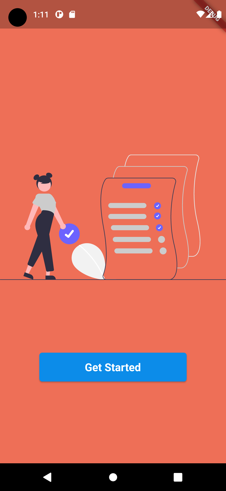
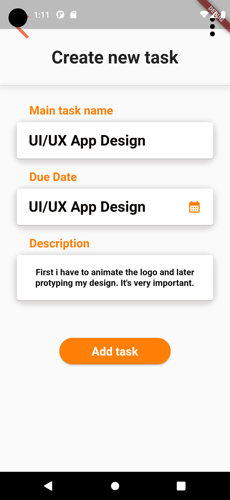
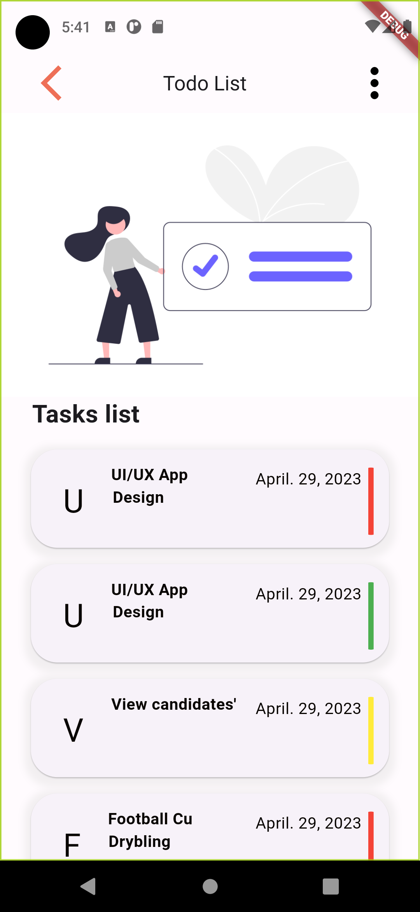
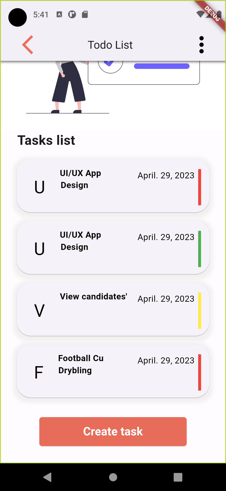
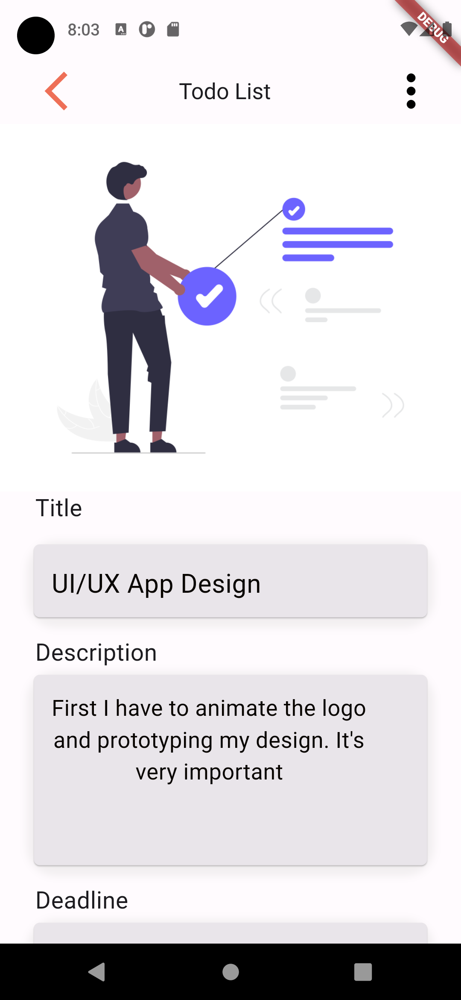
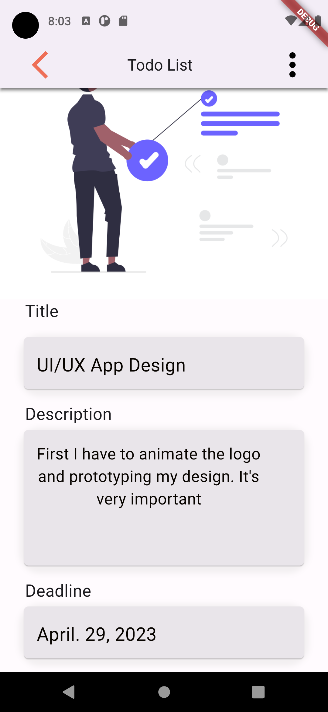

# To Do Mobile App

This project is a Todo Mobile app.

## Screenshots
|  | |
| ---------------------- | ---------------------- |
|  | |
| ---------------------- | ---------------------- |
|  | |

## Update Flutter Task 11 Part 1: Bloc State Management (Bloc Scaffolding)
- Task Event
  ```dart
    
   part of 'task_bloc.dart';
   
   sealed class TaskEvent extends Equatable {
     const TaskEvent();
   
     @override
     List<Object?> get props => [];
   }
   
   class GetTaskByIdEvent extends TaskEvent{
     final int id;
    
   
     const GetTaskByIdEvent(this.id);
   
     @override
     List<Object?> get props => [id];
   }
   
   class AddTaskEvent extends TaskEvent{
   
     final String id;
     final String title;
     final String description;
     final String dueDate;
     final bool status;
   
     const AddTaskEvent({required this.id, required this.title, required this.description, required this.dueDate, required this.status});
     
     @override
     List<Object?> get props => [id, title, description, dueDate, status];
   }
   
   class GetAllFromTask extends TaskEvent{}
   
   class GetCompletedFromTask extends TaskEvent{}
   
   class GetPendingFromTask extends TaskEvent{}
   
   class EditTaskEvent extends TaskEvent{
     final String id;
     final String title;
     final String description;
     final String dueDate;
     final bool status;
   
     const EditTaskEvent({required this.id, required this.title, required this.description, required this.dueDate, required this.status});
     
     @override
     List<Object?> get props => [id, title, description, dueDate, status];
   }
   
   class DeleteTaskEvent extends TaskEvent{
     final String id;
   
     const DeleteTaskEvent(this.id);
   
     @override
   
     List<Object?> get props => [id];
   
   }
   
  ```
- Task State
  ```dart
       part of 'task_bloc.dart';
    
    sealed class TaskState extends Equatable {
      const TaskState();
      
      @override
      List<Object> get props => [];
    }
    
    class TaskEmpty extends TaskState {}
    
    class TaskLoading extends TaskState {}
    
    class TaskLoaded extends TaskState {
      final Tasks task;
    
      const TaskLoaded({required this.task});
    
      @override
      List<Object> get props => [task];
    }
    
    class TaskAllLoaded extends TaskState {
      final List<Tasks> tasks;
    
      const TaskAllLoaded({required this.tasks});
      @override
      List<Object> get props => [tasks];
    }
    
    class AddState extends TaskState{
      final List<Tasks> tasks;
    
      const AddState({required this.tasks});
    
      @override
      List<Object> get props => [tasks];
    }
    
    class EditState extends TaskState{
      final List<Tasks> tasks;
    
      const EditState({required this.tasks});
    
      @override
      List<Object> get props => [tasks];
    }
    
    class DeleteState extends TaskState{
      final List<Tasks> tasks;
    
      const DeleteState({required this.tasks});
    
      @override
      List<Object> get props => [tasks];
    }
    
    class Error extends TaskState{
      final String message;
    
      const Error({required this.message});
    
      @override
      List<Object> get props => [message];
    }

  ```
- InputConverter
  ```dart
   class InputConverter {
    Either<Failure, int> stringToUnsignedInteget(String str){
      try{
        final integer = int.parse(str);
        if( integer < 0) throw const FormatException();
        return Right(integer);
      } on FormatException{
        return Left(InvalidInputFailure());
      }
    }
  }
  
  class InvalidInputFailure extends Failure{
    @override
    List<Object?> get props => [];
  
  }
  ```
- InputConverter Test
  ```dart
   void main(){
      late InputConverter inputConverter;
    
      setUp(() {
        inputConverter = InputConverter();
      });
    
      group('stringToUnsignedInt', () { 
        test('shoud return an integer when the string reperesents an unsigned integer', () {
          // arrange
    
          const str = "123";
          // act
          final result = inputConverter.stringToUnsignedInteget(str);
    
          // assert
          expect(result, const Right(123));
    
        });
        test('shoud return a failure when the string is not an integer', () {
          // arrange
    
          const str = "abc";
          // act
          final result = inputConverter.stringToUnsignedInteget(str);
    
          // assert
          expect(result, Left(InvalidInputFailure()));
    
        });
    
        test('shoud return a failure when the string is a negetive integer', () {
          // arrange
    
          const str = "-123";
          // act
          final result = inputConverter.stringToUnsignedInteget(str);
    
          // assert
          expect(result, Left(InvalidInputFailure()));
        });
    
       
      });
    }
    

  ```


## Update Flutter Task 10 Part 1: TDD and Clean Architecture (Local DataSource) 
 1) Implement the Local Data Source Class
    ```dart
      const CACHED_TASK = 'CACHED_TASK';
      
      class TaskLocalDataSourceImpl implements TaskLocalDataSource {
        final SharedPreferences sharedPreferences;
      
        TaskLocalDataSourceImpl({required this.sharedPreferences});
      
        @override
        Future<Tasks>? getLastTask() {
          final jsonString = sharedPreferences.getString(CACHED_TASK);
      
          if (jsonString != null) {
            return Future.value(TaskModel.fromJson(json.decode(jsonString)));
          } else {
            throw CacheException();
          }
        }
      
        @override
        Future<void>? cacheTask(TaskModel task) {
          sharedPreferences.setString(CACHED_TASK, json.encode(task.toJson()));
        }
      }
    ```
2) Testing
    ```
      @GenerateMocks([SharedPreferences], customMocks: [ MockSpec<SharedPreferences>(as: #MockSharedPreferencesForTest,),])
     
     void main(){
       late TaskLocalDataSourceImpl dataSource;
       late MockSharedPreferences mockSharedPreferences;
     
       setUp(() {
         mockSharedPreferences = MockSharedPreferences();
         dataSource = TaskLocalDataSourceImpl(sharedPreferences: mockSharedPreferences);
       });
     
       group('getLastTask', () { 
         final tTaskModel = TaskModel.fromJson(json.decode(fixture('todo_cached.json')));
     
         test('should return Tasks from SharedPreferences when there is one in the cache', () async {
           // arrange
           when(mockSharedPreferences.getString(any)).thenReturn(fixture('todo_cached.json'));
     
           // act
           final result = await dataSource.getLastTask();
         
           // assert
           verify(mockSharedPreferences.getString(CACHED_TASK));
           expect(result, equals(tTaskModel));
     
     
         });
         test('should throw a CacheException when there is not a chached value', () async {
           // arrange
           when(mockSharedPreferences.getString(any)).thenReturn(null);
     
           // act
           final call = dataSource.getLastTask;
         
           // assert
           expect(() => call(), throwsA(const TypeMatcher<CacheException>()));
     
     
         });
     
       });
     
       group('cacheTask', () { 
         final tTaskModel = TaskModel(id: 1, title: 'title', description: 'description', dueDate: DateTime.parse("2023-08-10T12:34:56.789Z"), status: false);
     
         test('should call SharedPreferences to cache the data', () async {
           
           // arrange
     
           when(mockSharedPreferences.setString(any, any))
               .thenAnswer((_) => Future.value(true));
           // act
           await dataSource.cacheTask(tTaskModel);
     
           // assert
           final expectedJsonString = json.encode(tTaskModel.toJson());
           verify(mockSharedPreferences.setString(CACHED_TASK, expectedJsonString,));
     
     
         });
     
       });
     
     }
   ```
    
   

## Update Flutter Task 9 Part 2: TDD and Clean Architecture (Network Info) 
 1) Create the NetworkInfo Class
    ```
       abstract class NetworkInfo {
        Future<bool>? get isConnected;
      }
      
      class NetworkInfoImpl implements NetworkInfo{
        final InternetConnectionChecker connectionChecker;
      
        NetworkInfoImpl(this.connectionChecker);
      
        @override
        Future<bool>? get isConnected => connectionChecker.hasConnection;
      
      }
    ```
    - Test
      ```
         @GenerateMocks([InternetConnectionChecker])
         void main() {
           late NetworkInfoImpl networkInfoImpl;
           late MockInternetConnectionChecker mockInternetConnection;
         
           setUp(() {
             mockInternetConnection = MockInternetConnectionChecker();
         
             networkInfoImpl = NetworkInfoImpl(mockInternetConnection);
           });
         
           group('isConnected', () {
             test(
                 'shouds forward the call the call to the InternectConnectionChecker.hasConnection',
                 () {
               // arrange
               final tHasConnectionFuture = Future.value(true);
               when(mockInternetConnection.hasConnection)
                   .thenAnswer((_) => tHasConnectionFuture);
         
               // act
               final result = networkInfoImpl.isConnected;
         
               // assert
               verify(mockInternetConnection.hasConnection);
               expect(result, tHasConnectionFuture);
         
             });
           });
         }
      ```
   

 2) Use NetworkInfo in the Repository
    ```
     final TaskRemoteDataSource remoteDataSource;
     final TaskLocalDataSource localDataSource;
     final NetworkInfo networkInfo;
     TaskRepositorisImpl(
         {required this.remoteDataSource,
         required this.localDataSource,
         required this.networkInfo});
     @override
     Future<Either<Failure, Tasks>>? searchTask(int taskId) async {
       networkInfo.isConnected;
       try {
         final task = await remoteDataSource.searchTask(taskId);
         return Right(task!);
       } catch (e) {
         return Left(
             TaskFailure(message: 'Failed to search task', type: e.runtimeType));
       }
     }
    
    ```


## Update Flutter Task 9 Part 1: TDD and Clean Architecture (Repository Implementation) 


- Set up a basic structure for your repository, and you're implementing all the logic at this stage from repository contracts from the domain layer .

   ```
      class TaskRepositorisImpl implements TaskRepository {
        final TaskRemoteDataSource remoteDataSource;
        final TaskLocalDataSource localDataSource;
        final NetworkInfo networkInfo;
        TaskRepositorisImpl(
            {required this.remoteDataSource,
            required this.localDataSource,
            required this.networkInfo});
      
        @override
        Future<Either<Failure, Unit>> addTask(Tasks task) async {
          try {
            await remoteDataSource.addTask(task);
            return const Right(unit);
          } catch (e) {
            return Left(
                TaskFailure(message: 'Failed to add task', type: e.runtimeType));
          }
        }
      
        @override
        Future<Either<Failure, List<Tasks>>>? viewAllTasks() async {
          try {
            final tasks = await remoteDataSource.viewAllTasks();
            return Right(tasks);
          } catch (e) {
            return Left(TaskFailure(
                message: 'Failed to view all tasks', type: e.runtimeType));
          }
        }
      
        @override
        Future<Either<Failure, List<Tasks>>> viewCompletedTasks() async {
          try {
            final completedTasks = await remoteDataSource.viewCompletedTasks();
            return Right(completedTasks);
          } catch (e) {
            return Left(TaskFailure(
                message: 'Failed to view completed tasks', type: e.runtimeType));
          }
        }
      
        @override
        Future<Either<Failure, List<Tasks>>> viewPendingTasks() async {
          try {
            final pendingTasks = await remoteDataSource.viewPendingTasks();
            return Right(pendingTasks);
          } catch (e) {
            return Left(TaskFailure(
                message: 'Failed to view pending tasks', type: e.runtimeType));
          }
        }
      
        @override
        Future<Either<Failure, Tasks>> searchTask(int taskId) async {
          networkInfo.isConnected;
          try {
            final task = await remoteDataSource.searchTask(taskId);
            return Right(task);
          } catch (e) {
            return Left(
                TaskFailure(message: 'Failed to search task', type: e.runtimeType));
          }
        }
      
        @override
        Future<Either<Failure, Unit>> editTask(
          Tasks task,
          String title,
          String description,
          DateTime dueDate,
          bool status,
        ) async {
          try {
            await remoteDataSource.editTask(
                task, title, description, dueDate, status);
            return const Right(unit);
          } catch (e) {
            return Left(
                TaskFailure(message: 'Failed to edit task', type: e.runtimeType));
          }
        }
      
        @override
        Future<Either<Failure, Unit>> delete(Tasks task) async {
          try {
            await remoteDataSource.delete(task);
            return const Right(unit);
          } catch (e) {
            return Left(
                TaskFailure(message: 'Failed to delete task', type: e.runtimeType));
          }
        }
      
        @override
        Future<Either<Failure, Unit>> markComplete(Tasks task) async {
          try {
            await remoteDataSource.delete(task);
            return const Right(unit);
          } catch (e) {
            return Left(TaskFailure(
                message: 'Failed to mark task as completed', type: e.runtimeType));
          }
        }
      }
  ```
## Update Flutter task 8 Part 2: TDD and Clean Architecture 

1. Contract and Repository:
   
   -Implement a contract that defines the methods a repository must fulfill
   
        ```
        class TaskRepositorisImpl implements TaskRepository {
            final TaskRemoteDataSource remoteDataSource;
            final TaskLocalDataSource localDataSource;
            final NetworkInfo networkInfo;
          
            TaskRepositorisImpl(
                {required this.remoteDataSource,
                required this.localDataSource,
                required this.networkInfo});
          
            @override
            Future<Either<Failure, Unit>>? addTask(Tasks task) {
              // TODO: implement addTask
              throw UnimplementedError();
            }
          
            @override
            Future<Either<Failure, Unit>>? delete(Tasks task) {
              // TODO: implement delete
              throw UnimplementedError();
            }
          
            @override
            Future<Either<Failure, Unit>>? editTask(Tasks task, String title,
                String description, DateTime dueDate, bool status) {
              // TODO: implement editTask
              throw UnimplementedError();
            }
          
            @override
            Future<Either<Failure, Unit>>? markComplete(Tasks task) {
              // TODO: implement markComplete
              throw UnimplementedError();
            }
          
            @override
            Future<Either<Failure, Tasks>>? searchTask(int id) {
              // TODO: implement searchTask
              throw UnimplementedError();
            }
          
            @override
            Future<Either<Failure, List<Tasks>>>? viewAllTasks() {
              // TODO: implement viewAllTasks
              throw UnimplementedError();
            }
          
            @override
            Future<Either<Failure, List<Tasks>>>? viewCompletedTasks() {
              // TODO: implement viewCompletedTasks
              throw UnimplementedError();
            }
          
            @override
            Future<Either<Failure, List<Tasks>>>? viewPendingTasks() {
              // TODO: implement viewPendingTasks
              throw UnimplementedError();
            }
          }
        ```
   - Create interfaces or abstract classes for repository dependencies, such as remote and local data sources.
I. Remote Data
     ```
     abstract class TaskRemoteDataSource {
       Future<Unit>? addTask(Tasks task);
     
       Future<List<Tasks>>? viewAllTasks();
     
       Future<List<Tasks>>? viewCompletedTasks();
     
       Future< List<Tasks>>? viewPendingTasks();
     
       Future<Tasks>? searchTask(int id);
     
       Future<Unit>? editTask(Tasks task, String title,
           String description, DateTime dueDate, bool status);
     
       Future<Unit>? delete(Tasks task);
       Future< Unit>? markComplete(Tasks task);
     }
     ```
II. Local Data
   
   ```
   abstract class TaskLocalDataSource{
       Future<Tasks> getLastTitle();
       Future<void> cacheTask(Tasks task);
     }
   ```
III. Network
   
   ```
   abstract class NetworkInfo{
       Future<bool> get isConnected;
     }
   ```


## Update Flutter task 8 Part 1: TDD and Clean Architecture 

1. Project Setup and Data Flow:
     ```
       todo_mobile_app/
      ├── lib/
      │   ├── core/
      │   │   ├── entities/
      │   │   │   ├── tasks.dart
      │   │   ├── error/
      │   │   │   ├── failure.dart
      │   │   ├── usecases/
      │   │   │   ├── usescases.dart
      │   ├── features/
      │   │   ├── todo_list/
      │   │   │   ├── data/
      │   │   │   │   ├── models/
      │   │   │   │   │   ├── task_model.dart
      │   │   │   ├── domain/
      │   │   │   │   ├── repositories/
      │   │   │   │   │   ├── todo_repository_contract.dart
      │   │   │   │   ├── usecases/
      │   │   │   │   │   ├── view_all_tasks.dart
      │   │   │   │   │   ├── view_specific_task.dart
      │   │   │   │   │   ├── add_task.dart
      ├── test/
      │   ├── core/
      │   ├── features/
      │   │   ├── todo_list/
      │   │   │   ├── data/
      │   │   │   │   ├── models/
      │   │   │   │   │   ├── todo_model_test.dart
      │   │   │   ├── domain/
      │   │   │   │   ├── usecases/
      │   │   │   │   │   ├── add_task_test.dart
      │   │   │   │   │   ├── view_all_task_test.dart
      │   │   │   │   │   ├── view_specific_task_test.dart
    ```
-Data Flow

I. Domain Layer:
  
  - The domain layer, located under features/todo_list/domain, contains the business logic of the "Todo List" feature.
  
  - It consists of use cases (or interactors) defined in the usecases directory. Use cases encapsulate specific actions or operations that can be performed on the "Todo List" feature.
  - For example, the ViewAllTasks use case represents the action of retrieving all tasks, while the AddTask use case represents the action of adding a new task.
  - Use cases orchestrate the flow of data and apply business rules to operate on the entities.
  - Use cases depend on repositories to fetch or store data.
  
II. Repository Layer:
  

  - The repository layer, located under features/todo_list/domain/repositories, defines interfaces (contracts) that provide access to the data sources.
  - For example, the TodoRepositoryContract defines the methods that must be implemented by specific repositories.
  - The use cases in the domain layer rely on these repository interfaces to fetch or store data.
  - The actual implementations of the repositories are defined in the data layer.
III. Data Layer:
  
  - The data layer, located under features/todo_list/data, is responsible for fetching and manipulating data.
  - It consists of models (models directory) that represent the data entities used in -the "Todo List" feature, such as the TaskModel class.
  - The data layer also includes repositories (repositories directory) that implement the repository interfaces defined in the domain layer.
  - For example, the TodoRepository implements the TodoRepositoryContract.
  - The repositories in the data layer interact with data sources to perform actual data retrieval or storage operations.
    

2. Implement Models:
   - model class
     ```  
      class TaskModel extends Tasks {
        TaskModel(String title, String description, DateTime dueDate, bool status)
            : super(title, description, dueDate, status);
      
        factory TaskModel.fromJson(Map<String, dynamic> json) {
          return TaskModel(json['title'], json['description'],
              DateTime.parse(json['dueDate']), json['status']);
        }
      
        Map<String, dynamic> toJson() {
          return {
            'title': title,
            'description': description,
            'dueDate': dueDate,
            'status': status
          };
        }
      }
    ```
  - model test
    

     ```
      void main() {
        final tTaskModel = TaskModel("Test Task", "This is an example task",
            DateTime.parse("2023-08-10T12:34:56.789Z"), false);
      
        test('should be a subclass of Tasks entity', () async {
          //assert
          expect(tTaskModel, isA<Tasks>());
        });
      
        test('should return a valid model from the JSON', () async {
          //arrange
      
          final Map<String, dynamic> taskModel = json.decode(fixture('todo.json'));
      
          // act
          final result = TaskModel.fromJson(taskModel);
      
          //assert
          expect(result, isA<TaskModel>());
          expect(result.title, tTaskModel.title);
          expect(result.description, tTaskModel.description);
          expect(result.dueDate, tTaskModel.dueDate);
          expect(result.status, tTaskModel.status);
        });
      
        test('should return a JSON map containing the proper data', () async {
          // act
          final result = tTaskModel.toJson();
      
          //assert
          final expectedMap = {
            "title": "Test Task",
            "description": 'This is an example task',
            "dueDate": DateTime.parse('2023-08-10T12:34:56.789Z'),
            "status": false,
          };
          expect(result, expectedMap);
        });
      }

     ```

## Update Flutter task 7 Part 2: TDD and Clean Architecture 

1. Entities:
```
class Tasks {
  static int _currentId = 0;
  int id;
  String _title;
  String _description;
  DateTime _dueDate;
  bool _status;

  Tasks(this._title, this._description, this._dueDate, this._status) : id = ++ _currentId;

  set title(String title) {
    _title = title;
  }

  String get title => _title;

  set description(String description) {
    _description = description;
  }

  String get description => _description;

  set dueDate(DateTime dueDate) {
    _dueDate = dueDate;
  }

  DateTime get dueDate => _dueDate;

  set status(bool status) {
    _status = status;
  }

  bool get status => _status;

  void markCompleted(){
    _status = true;
  }

  void displayTask() {
    print("Title:  $_title");
    print("Description:  $_description");
    print("Due Date:  $_dueDate");
    print("Status:  $_status");
  }
}
```
2. UseCases:
   ```    
    abstract class UseCase<Type, Params> {
    Future<Either<Failure, Type>?> call(Params params);
    }
    
    class NoParams extends Equatable {
      @override
      List<Object?> get props => [];
    }

   ```
   
 - View All Tasks
      ```

        class ViewAllTask implements UseCase<List<Tasks>, NoParams> {
          final TaskRepository repository;
        
          ViewAllTask(this.repository);
        
          @override
          Future<Either<Failure, List<Tasks>>?> call(NoParams params) async {
           return await repository.viewAllTasks();
          }
        }

    ```
- View Specific Tasks
    ```
        class ViewSpecificTask implements UseCase<Tasks, Params> {
          final TaskRepository repository;
        
          ViewSpecificTask(this.repository);
        
          @override
          Future<Either<Failure, Tasks>?> call(Params params) async {
            try {
              final task = await repository.searchTask(params.id);
              return task;
            } catch (e) {
              return Left(TaskFailure(
                  message: 'Failed to retrieve task', type: e.runtimeType));
            }
          }
        }
        
        class Params {
          final int id;
          const Params(this.id);
        }


      ```
- Create New Tasks
  
      ```
        class AddTask implements UseCase<Unit, Params> {
          final TaskRepository repository;
        
          AddTask(this.repository);
        
          @override
          Future<Either<Failure, Unit>> call(Params params) async {
            try {
              await repository.addTask(params.task);
              return const Right(unit);
            } catch (e) {
              return Left(
                  TaskFailure(message: 'Failed to retrieve task', type: 
                  e.runtimeType));
            }
          }
        }
        
        class Params {
          final Tasks task;
          const Params(this.task);
        }

      ```
3. UseCases Testing:
   
  


   -Add task Test
   ```
   class MockTaskRepository extends Mock implements TaskRepository {}

    @GenerateMocks([Tasks])
    void main() {
      late AddTask usecase;
      late MockTaskRepository mockTaskRepository;
      late Tasks tTasks;
    
      setUp(() {
        mockTaskRepository = MockTaskRepository();
        usecase = AddTask(mockTaskRepository);
        tTasks = Tasks("Test", "Mock Testing", DateTime.now(), false);
      });
    
      test('should add task', () async {
        //arrange
        when(mockTaskRepository.addTask(tTasks))
            .thenAnswer((_) async => const Right(unit));
        //act
        final result = await usecase(Params(tTasks));
    
        //assert
        expect(result, const Right(unit));
        verify(mockTaskRepository.addTask(tTasks));
        verifyNoMoreInteractions(mockTaskRepository);
      });
    }

   ```
- View All Task Test
   ```
   class MockTaskRepository extends Mock implements TaskRepository {}

    @GenerateMocks([Tasks])
    void main() {
      group('ViewAllTaskUseCase', () {
        late ViewAllTask usecase;
        late MockTaskRepository mockTaskRepository;
        late List<Tasks> tTask;
    
        setUp(() {
          mockTaskRepository = MockTaskRepository();
          usecase = ViewAllTask(mockTaskRepository);
          tTask = [
            Tasks('Test Title', 'Test description', DateTime.now(), false),
            Tasks('Test2 Title', 'Test2 description', DateTime.now(), true),
          ];
        });
    
        test('should Get a list of tasks from repository', () async {
          // Arrange
          when(mockTaskRepository.viewAllTasks())
              .thenAnswer((_) async => Right(tTask));
    
          //Act
          final result = await usecase(NoParams());
    
          //Assert
          expect(result, Right(tTask));
          verify(mockTaskRepository.viewAllTasks());
          verifyNoMoreInteractions(mockTaskRepository);
        });
      });
    }
   ```
- View Specific Task Test
  ```
  class MockTaskRepository extends Mock implements TaskRepository {}
    @GenerateMocks([Tasks])
    void main() {
      group('ViewSpecificTaskUseCase', () {
        late ViewSpecificTask usecase;
        late MockTaskRepository mockTaskRepository;
        late int id;
        late Tasks tTask;
    
        setUp(() {
          mockTaskRepository = MockTaskRepository();
          usecase = ViewSpecificTask(mockTaskRepository);
          id = 1;
          tTask = Tasks('Test Title', 'Test description', DateTime.now(), false);
        });
    
        test('should Get a specific task from repository', () async {
          // Arrange
          when(mockTaskRepository.searchTask(id))
              .thenAnswer((_) async => Right(tTask));
    
          //Act
          final result = await usecase(Params(id));
    
          //Assert
          expect(result, Right(tTask));
          verify(mockTaskRepository.searchTask(id));
          verifyNoMoreInteractions(mockTaskRepository);
        });
      });
    }
  ```
  
   
   


## Update Flutter task 7 Part 1: TDD and Clean Architecture 

1. Set Due Date Feature:
```
void editTask() {
    String taskName = _taskNameController.text;
    String taskDescription = _taskDescriptionController.text;
    String taskDate = _taskDateController.text;
    bool status = widget.task.status;

    DateTime parsedDate = DateTime.tryParse(taskDate) ?? DateTime.now();

    if (taskName.isNotEmpty && taskDescription.isNotEmpty) {
      TaskRepositorisImpl taskManager = TaskRepositorisImpl();
      taskManager.editTask(
          widget.task, taskName, taskDescription, parsedDate, status);
    }

    Navigator.pushNamed(context, viewTask,
        arguments: {'title': taskName, 'description': taskDescription});
  }
```
```
  TextField(
        key: Key(widget.keys),
        maxLines: widget.lines,
        controller: widget.controller, // Disable text input
        decoration: InputDecoration(
          border: InputBorder.none,
          contentPadding: const EdgeInsets.all(20),
          suffixIcon: widget.setDate
              ? const Icon(
                  Icons.calendar_month,
                  color: Color.fromRGBO(243, 140, 89, 1),
                )
              : null,
        ),
       
        onTap: widget.setDate
            ? () async {
                DateTime? pickedDate = await showDatePicker(
                  context: context,
                  initialDate: DateTime.now(),
                  firstDate: DateTime(2000),
                  lastDate: DateTime(2101),
                );
                if (pickedDate != null) {
                  setState(() {
                    widget.controller.text =
                        DateFormat('yyyy-MM-dd').format(pickedDate);
                  });
                }
              }
            : null,
      )
  ```    
2. Mark Tasks as Completed Feature:

  ```
  void complete() {
    TaskRepositorisImpl taskManager = TaskRepositorisImpl();
    taskManager.markComplete(widget.task);

    Navigator.pushNamed(context, viewTask,
        arguments: {'title': '', 'description': ''});
  }
```
```
            ElevatedButton(
              style: ElevatedButton.styleFrom(
                backgroundColor: Colors.green,
                foregroundColor: Colors.white,
                shape: RoundedRectangleBorder(
                  borderRadius: BorderRadius.circular(30),
                ),
              ),
              onPressed: () async {
                complete();
              },
              child: const Text(
                "Completed",
                style: TextStyle(
                    fontSize: 25,
                    fontFamily: "Inter",
                    fontWeight: FontWeight.bold),
              ),
            )
```
3. Error Handling and Either Type:
```
   
  @override
  Future<Either<Failure, Unit>> addTask(Tasks task) async {
    try {
      tasks.add(task);
      return const Right(unit);
    } catch (e) {
      return Left(
          TaskFailure(message: 'Failed to add task', type: e.runtimeType));
    }
  }
```
          


## Update Flutter task 6: Testing


1. Test Task Listing

```
testWidgets('Test Task Listing', (WidgetTester tester) async {
  // Build our app and trigger a frame.
  await tester.pumpWidget(
    MaterialApp(
      home: ViewToDoList(values: {'title': '', 'description': ''}),
    ),
  );

  // Add your test assertions here
});
```

2. Test Task Creation

```
testWidgets('Test task Creation', (WidgetTester tester) async {
    // Build our app and trigger a frame.
    await tester.pumpWidget(
      const MaterialApp(
        title: "To Do Mobile App",
        onGenerateRoute: MyRoutes.generateRoute,
        initialRoute: '/addTask',
      ),
    );

    await tester.enterText(find.byKey(const Key('titleField')), 'Task Title');
    await tester.enterText(
        find.byKey(const Key('descriptionField')), 'Task Description');

    final addTaskButton = find.text('Add task');

    await tester.tap(addTaskButton);
    await tester.pumpAndSettle();

    // Verify the task object.
    final task = Task('Task Title', 'Task Description', DateTime.now(), false);

    // Verify that our counter starts at 0.
    expect(task.title, 'Task Title');
    expect(task.description, 'Task Description');
  });
```
3. Test onboarding page navigation

```
testWidgets('Test onboarding page navigation', (WidgetTester tester) async {
    // Build our app and trigger a frame.
    await tester.pumpWidget(
      const MaterialApp(
        home: MyApp(),
      ),
    );

    final getStartedButton = find.text('Get Started');
    await tester.tap(getStartedButton);
    await tester.pumpAndSettle();
    // Verify that our counter starts at 0.
    expect(find.byType(ViewToDoList), findsOneWidget);
  });
```
4. Add task displays correct UI

```
testWidgets('Add task displays correct UI', (WidgetTester tester) async {
    // Build our app and trigger a frame.
    await tester.pumpWidget(
      const MaterialApp(
        home: NewTaskFrame()
      ),
    );

    // Verify that various text elements are found.
    expect(find.text('Create new task'), findsOneWidget);
    expect(find.text('Main task name'), findsOneWidget);
    expect(find.text('Due date'), findsOneWidget);
    expect(find.text('Description'), findsOneWidget);
    expect(find.byType(TextField), findsNWidgets(2));
    expect(find.byType(ElevatedButton), findsOneWidget);
  });
```

5. Test empty tasks

```
testWidgets('Test empty tasks', (WidgetTester tester) async {
    // Build our app and trigger a frame.
    await tester.pumpWidget(
      const MaterialApp(
        home: NewTaskFrame(),
      ),
    );

    final textFieldFinder = find.byKey(const Key('titleField'));
    final textField = tester.widget<TextField>(textFieldFinder);

    expect(textField.controller!.text.isEmpty, isTrue);
  });

```

## Installation

To install and run the Todo App, please follow the steps below:

1. Make sure you have Flutter and Dart installed on your machine. If not, please refer to the official Flutter installation guide: [Flutter Installation](https://flutter.dev/docs/get-started/install)

2. Clone the repository from GitHub:
git clone https://github.com/mihretgold/2023-project-phase-mobile-tasks.git


3. Navigate to the project directory:

cd todo_mobile_app
git checkout -b mihret.navigation_task
git pull origin mihret.navigation_task

4. Fetch the dependencies:
 -flutter pub get

5. Connect your device or start an emulator.

6. Run the app:
  -flutter run
